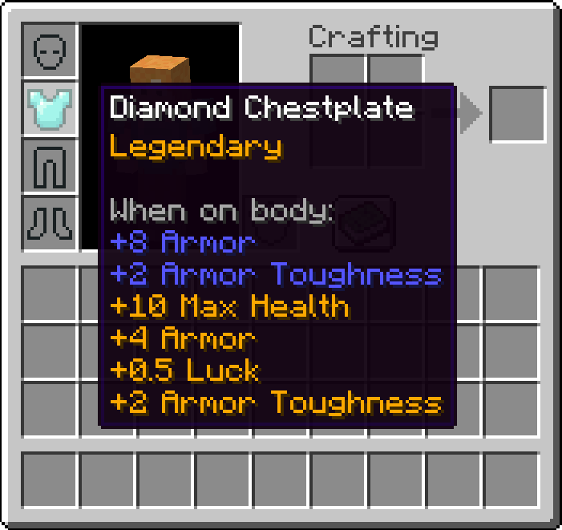

# Tiered

Tiered is a Fabric mod inspired by [Quality Tools](https://www.curseforge.com/minecraft/mc-mods/quality-tools). Every tool you make will have a special modifier, as seen below:



### Customization

Tiered is entirely data-driven, which means you can add, modify, and remove modifiers as you see fit. The base path for modifiers is `data/modid/item_attributes`, and tiered modifiers are stored under the modid of tiered. Here's an example modifier called "Hasteful," which grants additional dig speed when any of the valid tools are held:
```json
{
  "id": "tiered:hasteful",
  "verifiers": [
    {
      "tag": "c:pickaxes"
    },
    {
      "tag": "c:shovels"
    },
    {
      "tag": "c:axes"
    }
  ],
  "weight": 10,
  "style": {
    "color": "GREEN"
  },
  "attributes": [
    {
      "type": "generic.dig_speed",
      "modifier": {
        "name": "tiered:hasteful",
        "operation": "MULTIPLY_TOTAL",
        "amount": 0.10
      },
      "optional_equipment_slots": [
        "MAINHAND"
      ]
    }
  ]
}
```

Tiered currently provides 3 custom attributes: Dig Speed, Crit chance and Durability. Dig Speed increases the speed of your block breaking (think: haste), Crit Chance offers an additional random chance to crit when using a tool and Durability increases, who would have thought it, the durability of an item.

### Verifiers

A verifier (specified in the "verifiers" array of your modifier json file) defines whether or not a given tag or tool is valid for the modifier. 

A specific item ID can be specified with:
```json
"id": "minecraft:apple"
```

and a tag can be specified with:
```json
"tag": "c:helmets"
```

Tiered doesn't provide tags but [AutoTag](https://github.com/apace100/autotag) (which is included in this mod) generates several tags which can be found on the repo [README](https://github.com/apace100/autotag#readme).
Example tags which AutoTag provides: `c:tools`,`c:pickaxes`,`c:axes`,`c:shovels`,`c:hoes`,`c:swords`,`c:armor`,`c:helmets`,`c:chestplates`,`c:leggings`,`c:boots` and several more.

### Weight

The weight determines the commonness of the tier. Higher weights increase the chance of being applied on the item and vice versa.

### Nbt

Custom nbt can get added via nbtValues, an example can be found below. It supports only string, boolean, integer and double values.\ 
Caution! Once added nbt keys won't get removed when once applied, just the values can get updated!

```json
"nbtValues": {
  "Damage": 100,
  "key": "value"
}
```

### License
Tiered is licensed under MIT. You are free to use the code inside this repo as you want.